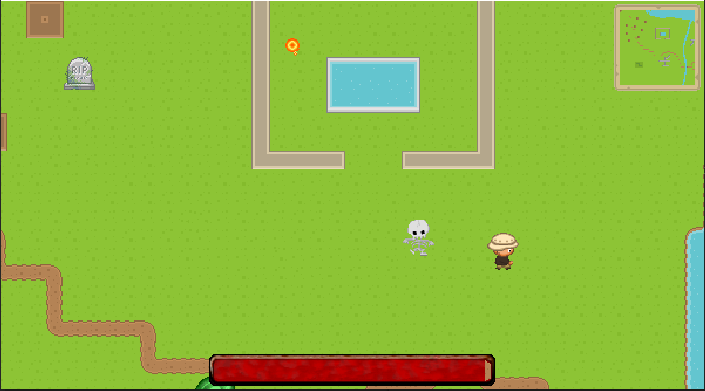
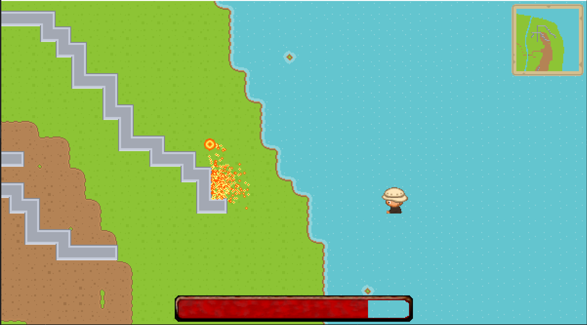

# Runes 

This is a 2D game engine. Rendering is CPU based and uses pixel arrays for graphical assests and the screen. Collision detection and path-finding is complete as well as projectiles and the mini map. A particle system is used for projectiles and footsteps.

# Development Environment

* Java 8
* JKD-11 or higher

The only external library used is for handling the json objects for loading level maps and the necessary files are included in json folder named json.

# Gameplay
## Controls
* WASD - move
* Shift - Run
* Mouse to aim
* Left Mouse Button - Shoot Fireball
* Right Mouse Button - Shoot Arrow

## Screenshots

